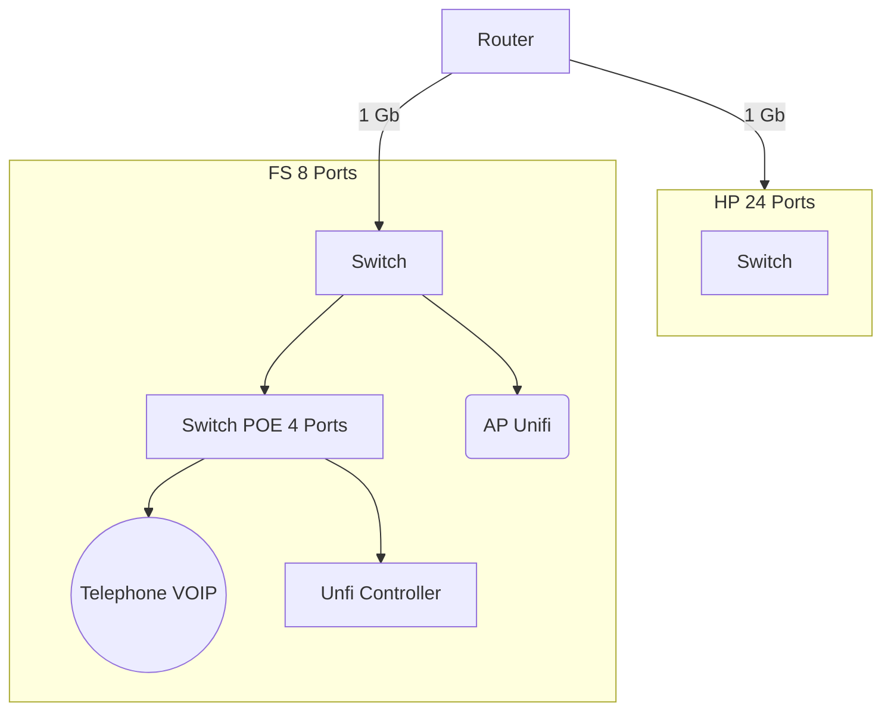

```mermaid
graph TB
    router[Router] -- 1 Gb --> switch1
    router -- 1 Gb --> switchfs8

    subgraph switch1[HP 24 Ports]
        switchhp24[Switch]
    end
    subgraph switch2[FS 8 Ports]
        switchfs8[Switch]
        switchfs8 --> switchpoe4[Switch POE 4 Ports]
        switchpoe4 --> phone((Telephone VOIP))
        switchpoe4 --> unific[Unfi Controller]
        switchfs8 --> unifiap(AP Unifi)
    end
```
